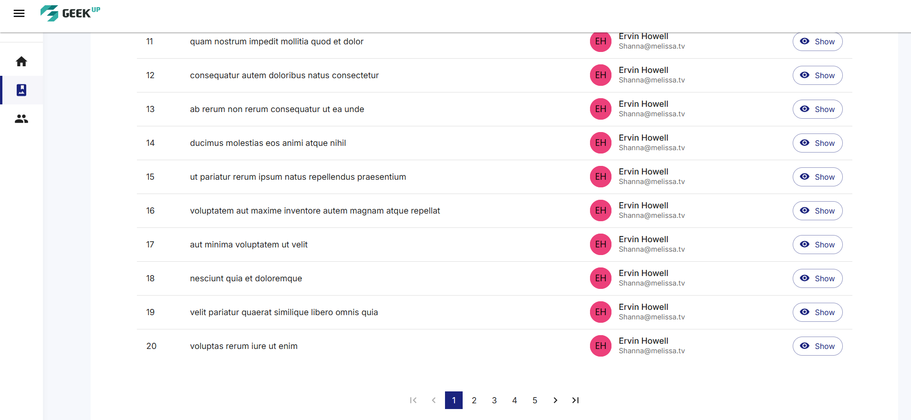

# GEEK<sup>UP</sup> Album Manager

A modern React application for browsing and managing photo albums and users. This application uses the JSONPlaceholder API to fetch and display albums, photos, and user information.

## Features

- Browse and view photo albums
- View detailed information about each album
- Browse user profiles
- View albums by user
- Responsive design for all device sizes
- Material UI components for a modern look and feel

## Technologies Used

- React 19
- React Router 7
- Material UI 7
- Axios for API requests
- Vite for fast development and building
- JSONPlaceholder API for mock data

## Installation and Setup

1. Clone the repository:
   ```bash
   git clone <https://github.com/minduck1103/technical-geekup.git>
   cd technical-geekup
   ```

2. Install dependencies:
   ```bash
   npm install
   ```

3. Start the development server:
   ```bash
   npm run dev
   ```

4. Build for production:
   ```bash
   npm run build
   ```

5. Preview the production build:
   ```bash
   npm run preview
   ```

## Usage

- **Home Page**: Overview of the application with featured albums
- **Albums Page**: Browse all albums with pagination
- **Album Detail Page**: View photos within a specific album
- **Users Page**: Browse all users
- **User Detail Page**: View user information and their albums

## Screenshots

### Home Page


### Albums Page


### Album Detail Page


### Users Page


### User Detail Page


> **Note**: To add screenshots, create a `screenshots` directory in the project root and add your screenshots with the names mentioned above.

## API Information

This application uses the JSONPlaceholder API for mock data:
- Base URL: https://jsonplaceholder.typicode.com
- Endpoints:
  - `/albums` - Get all albums
  - `/albums/:id` - Get a specific album
  - `/photos?albumId=:id` - Get photos for a specific album
  - `/users` - Get all users
  - `/users/:id` - Get a specific user

For avatar generation, the application uses UI Avatars API:
- Base URL: https://ui-avatars.com/api

For photo placeholders, the application uses multiple services:
- Unsplash Source
- Lorem Picsum
- Placeholder.com
- PlaceBear
- PlaceKitten

## Project Structure

```
album-manager/
├── public/              # Static assets
├── src/
│   ├── api/             # API service functions
│   ├── assets/          # Images and other assets
│   ├── components/      # Reusable components
│   ├── pages/           # Page components
│   │   ├── albums/      # Album-related pages
│   │   └── users/       # User-related pages
│   ├── router/          # React Router configuration
│   ├── App.jsx          # Main application component
│   ├── App.css          # Application styles
│   ├── index.css        # Global styles
│   └── main.jsx         # Application entry point
├── index.html           # HTML template
├── package.json         # Project dependencies and scripts
└── vite.config.js       # Vite configuration
```

## Contributing

1. Fork the repository
2. Create your feature branch (`git checkout -b feature/amazing-feature`)
3. Commit your changes (`git commit -m 'Add some amazing feature'`)
4. Push to the branch (`git push origin feature/amazing-feature`)
5. Open a Pull Request

## License

This project is licensed under the MIT License - see the LICENSE file for details.
